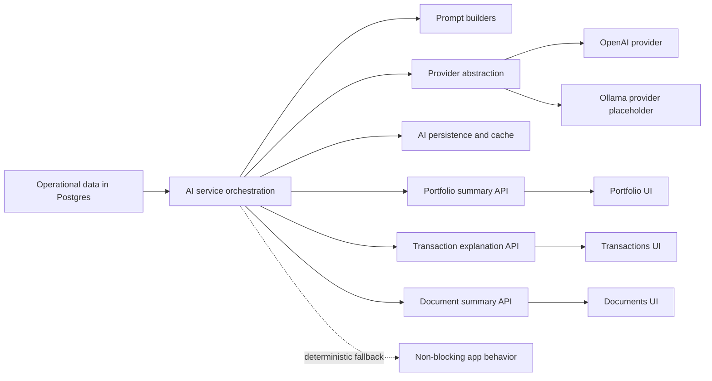
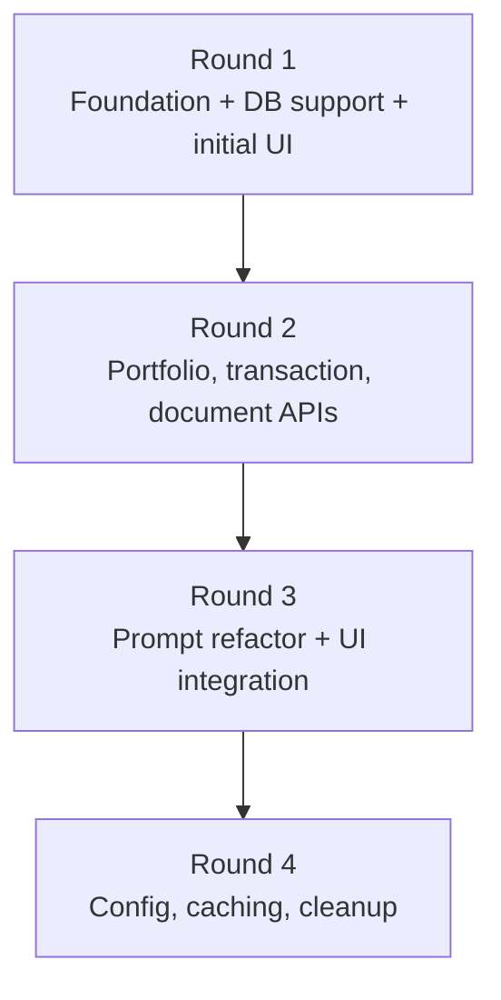
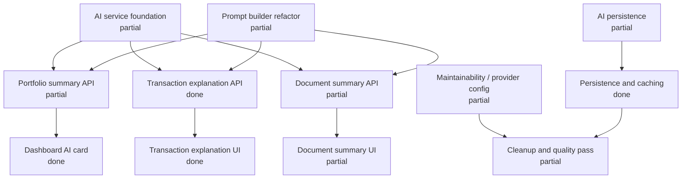

# Phase 2 Plan

## Objective

Add an AI interpretation layer on top of the existing application without changing the core operational model.

## Phase Diagram

## Scope

- AI service modules
- model/provider abstraction so hosted or local LLMs can be swapped later
- prompt builders
- AI endpoints for portfolio summary, transaction explanation, and document summarization
- optional persistence for AI requests and responses
- focused UI widgets for AI-generated insights
- outputs grounded in existing application data

## Out of Scope

- blockchain logic
- wallet integration
- tokenomics
- autonomous agents
- AI write-back into holdings or orders
- full general-purpose chat platform

## Status Snapshot

### Round 1

- Master prompt: `partial`
- Prompt 1, AI service foundation: `partial`
- Prompt 2, AI DB support: `partial`
- Prompt 6, dashboard AI insights card: `done`

### Round 2

- Prompt 3, portfolio summary API: `partial`
- Prompt 4, transaction explanation API: `done`
- Prompt 5, document summarization API: `partial`

### Round 3

- Prompt 7, prompt builder refactor: `partial`
- Prompt 8, transaction explanation UI: `done`
- Prompt 9, document summary UI: `partial`

### Round 4

- Prompt 10, maintainability/provider config: `partial`
- Prompt 11, persistence and caching: `done`
- Prompt 12, cleanup and quality pass: `partial`

## Recommended Execution Order

### Round 1

1. Master prompt
2. Prompt 1
3. Prompt 2
4. Prompt 6

### Round 2

1. Prompt 3
2. Prompt 4
3. Prompt 5

### Round 3

1. Prompt 7
2. Prompt 8
3. Prompt 9

### Round 4

1. Prompt 10
2. Prompt 11
3. Prompt 12

## Execution Flow

## Current Implementation

### Already in Place

- AI service layer:
  - [`apps/api/src/services/ai/index.ts`](/Users/prasadrane/Brickly/apps/api/src/services/ai/index.ts)
  - [`apps/api/src/services/ai/providers/openai.provider.ts`](/Users/prasadrane/Brickly/apps/api/src/services/ai/providers/openai.provider.ts)
  - [`apps/api/src/services/ai/providers/ollama.provider.ts`](/Users/prasadrane/Brickly/apps/api/src/services/ai/providers/ollama.provider.ts)
  - [`apps/api/src/services/ai/providers/provider-factory.ts`](/Users/prasadrane/Brickly/apps/api/src/services/ai/providers/provider-factory.ts)
  - [`apps/api/src/services/ai/types/index.ts`](/Users/prasadrane/Brickly/apps/api/src/services/ai/types/index.ts)
- Prompt builders:
  - [`apps/api/src/services/ai/promptBuilders/portfolioSummary.ts`](/Users/prasadrane/Brickly/apps/api/src/services/ai/promptBuilders/portfolioSummary.ts)
  - [`apps/api/src/services/ai/promptBuilders/documentSummary.ts`](/Users/prasadrane/Brickly/apps/api/src/services/ai/promptBuilders/documentSummary.ts)
  - [`apps/api/src/services/ai/promptBuilders/transactionExplanation.ts`](/Users/prasadrane/Brickly/apps/api/src/services/ai/promptBuilders/transactionExplanation.ts)
- Formatters:
  - [`apps/api/src/services/ai/formatters/summary.ts`](/Users/prasadrane/Brickly/apps/api/src/services/ai/formatters/summary.ts)
  - [`apps/api/src/services/ai/formatters/json.ts`](/Users/prasadrane/Brickly/apps/api/src/services/ai/formatters/json.ts)
  - [`apps/api/src/services/ai/formatters/debug.ts`](/Users/prasadrane/Brickly/apps/api/src/services/ai/formatters/debug.ts)
- AI persistence:
  - [`apps/api/prisma/schema.prisma`](/Users/prasadrane/Brickly/apps/api/prisma/schema.prisma)
  - [`apps/api/prisma/migrations/20260324161000_phase2_ai_persistence/migration.sql`](/Users/prasadrane/Brickly/apps/api/prisma/migrations/20260324161000_phase2_ai_persistence/migration.sql)
  - [`apps/api/src/repositories/ai.repository.ts`](/Users/prasadrane/Brickly/apps/api/src/repositories/ai.repository.ts)
- API endpoints:
  - portfolio summary AI
  - transaction explanation AI
  - document summarization AI
- Web UI:
  - [`apps/web/pages/portfolio.tsx`](/Users/prasadrane/Brickly/apps/web/pages/portfolio.tsx)
  - [`apps/web/pages/transactions.tsx`](/Users/prasadrane/Brickly/apps/web/pages/transactions.tsx)
  - [`apps/web/pages/documents.tsx`](/Users/prasadrane/Brickly/apps/web/pages/documents.tsx)
  - [`apps/web/services/ai/index.ts`](/Users/prasadrane/Brickly/apps/web/services/ai/index.ts)

### Main Gaps

- some prompt contracts were implemented under `/v1/...` routes rather than the exact prompt paths
- portfolio summary response is still simpler than the richest requested structured shape
- document summary authorization remains strict
- document summary and portfolio UI labeling/shape can still be tightened
- AI explanation cache can drift from changed operational verification states
- provider abstraction exists but Ollama is still placeholder-only

## Implementation Status Map

## Concrete Plan

### Prompt 1: AI Service Foundation

Files already in place:

- `apps/api/src/services/ai/providers/`
- `apps/api/src/services/ai/promptBuilders/`
- `apps/api/src/services/ai/formatters/`
- `apps/api/src/services/ai/types/`

Follow-up tasks:

- keep provider abstraction clean
- implement a real second provider when needed
- avoid leaking provider logic back into orchestration

### Prompt 2: AI Persistence

Files already in place:

- `apps/api/prisma/schema.prisma`
- `apps/api/prisma/migrations/20260324161000_phase2_ai_persistence/migration.sql`
- `apps/api/src/repositories/ai.repository.ts`

Follow-up tasks:

- extend prompt template usage if prompt versioning becomes operational
- expose audit views if needed for admin/demo review

### Prompt 3: Portfolio Summary Contract

Files to revisit:

- `apps/api/src/services/ai/index.ts`
- `apps/api/src/services/ai/promptBuilders/portfolioSummary.ts`
- `apps/web/services/ai/index.ts`
- `apps/web/pages/portfolio.tsx`

Follow-up tasks:

- optionally expand response shape to include:
  - `keyConcentrationNote`
  - `recentActivityNote`
  - `yieldObservation`
  - `suggestions`

### Prompt 5 and Prompt 9: Document Summary Shape and UI

Files to revisit:

- `apps/api/src/services/ai/index.ts`
- `apps/api/src/services/ai/promptBuilders/documentSummary.ts`
- `apps/web/pages/documents.tsx`

Follow-up tasks:

- refine structured extraction and rendering
- revisit authorization if investor demo needs broader summary access
- improve messaging around metadata-only summaries

### Prompt 10 and Prompt 12: Maintainability and Cleanup

Files to revisit:

- `apps/api/src/services/ai/index.ts`
- `apps/api/src/services/ai/providers/provider-factory.ts`
- `apps/api/src/services/ai/formatters/debug.ts`
- `apps/web/pages/transactions.tsx`
- `apps/web/pages/documents.tsx`

Follow-up tasks:

- keep debug logging development-only
- unify response shape conventions where helpful
- ensure cached AI text is invalidated or refreshed when important underlying state changes

## Verification Checklist

### Backend

- `npm --workspace apps/api run prisma:generate`
- `npm --workspace apps/api run build`

### Web

- `npm --workspace apps/web run build`

### Database

- apply AI persistence migration
- verify `AiRequest` and `AiResponse` rows are created

### Manual Demo Checks

1. Portfolio AI summary renders with live provider output
2. Transaction explanation renders from the transactions page
3. Document summary renders structured AI output
4. Cache reuse prevents unnecessary regeneration
5. App still works when provider falls back to deterministic mode

## Notes

- Postgres remains the source of truth.
- AI stays additive and non-blocking.
- Prompt builders and providers should remain isolated from controllers and operational services.
