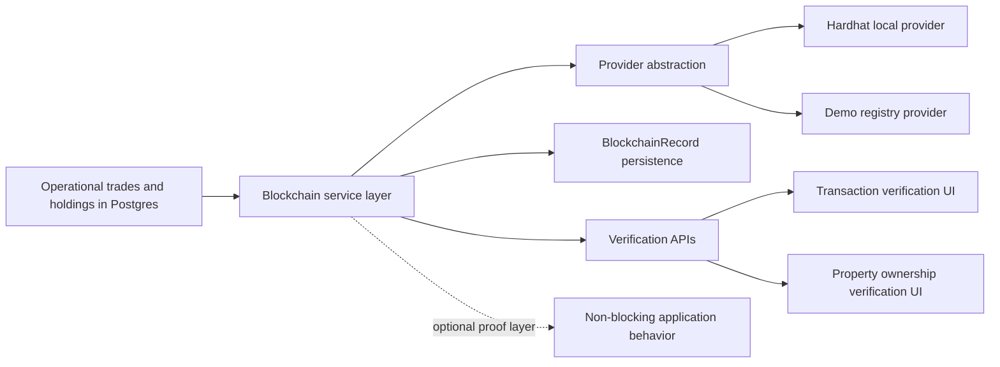
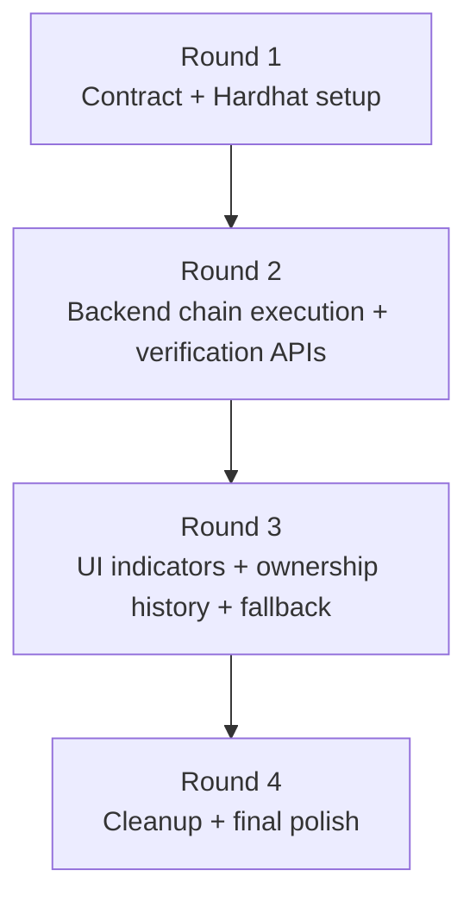
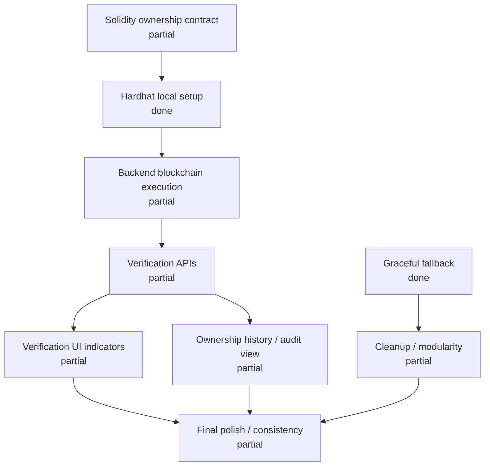

# Phase 3 Plan

## Objective

Add a blockchain trust layer for ownership and transaction verification while keeping Postgres as the operational source of truth and preserving non-blocking application behavior.

## Phase Diagram

## Scope

- smart contract for ownership and transfers
- blockchain service layer in the backend
- syncing blockchain transactions to the database
- exposing verification data via APIs
- UI indicators for verified ownership and transactions

## Out of Scope

- real payments
- end-user crypto wallets
- tokenomics
- public trading
- mainnet deployment

## Status Snapshot

### Round 1

- Master prompt: `partial`
- Prompt 1, Solidity ownership contract: `partial`
- Prompt 2, Hardhat local setup: `done`

### Round 2

- Prompt 3, backend blockchain service with real Hardhat/contract calls: `partial`
- Prompt 4, blockchain verification APIs: `partial`

### Round 3

- Prompt 5, blockchain verification UI indicators: `partial`
- Prompt 6, ownership history/audit view: `partial`
- Prompt 7, robustness and graceful fallback: `done`

### Round 4

- Prompt 8, cleanup and modularity pass: `partial`
- Prompt 9, final polish/consistency pass: `partial`

## Recommended Execution Order

### Round 1

1. Master prompt
2. Prompt 1
3. Prompt 2

### Round 2

1. Prompt 3
2. Prompt 4

### Round 3

1. Prompt 5
2. Prompt 6
3. Prompt 7

### Round 4

1. Prompt 8
2. Prompt 9

## Execution Flow

## Current Implementation

### Already in Place

- Solidity demo contract source:
  - [`contracts/BricklyOwnershipRegistry.sol`](/Users/prasadrane/Brickly/contracts/BricklyOwnershipRegistry.sol)
- Backend blockchain module:
  - [`apps/api/src/services/blockchain/index.ts`](/Users/prasadrane/Brickly/apps/api/src/services/blockchain/index.ts)
  - [`apps/api/src/services/blockchain/providers/demo-registry.provider.ts`](/Users/prasadrane/Brickly/apps/api/src/services/blockchain/providers/demo-registry.provider.ts)
  - [`apps/api/src/services/blockchain/providers/provider-factory.ts`](/Users/prasadrane/Brickly/apps/api/src/services/blockchain/providers/provider-factory.ts)
  - [`apps/api/src/services/blockchain/types.ts`](/Users/prasadrane/Brickly/apps/api/src/services/blockchain/types.ts)
- Blockchain persistence:
  - [`apps/api/prisma/schema.prisma`](/Users/prasadrane/Brickly/apps/api/prisma/schema.prisma)
  - [`apps/api/prisma/migrations/20260325093000_phase3_blockchain_foundation/migration.sql`](/Users/prasadrane/Brickly/apps/api/prisma/migrations/20260325093000_phase3_blockchain_foundation/migration.sql)
- Verification APIs:
  - property verification
  - transaction verification
  - property ownership proof recording
  - transaction transfer proof recording
  - pending proof sync
- UI indicators:
  - transaction verified/pending state
  - transaction blockchain reference
  - property ownership verification panel
- Robust fallback behavior:
  - blockchain layer can be disabled without breaking the app

### Main Gaps

- no real JSON-RPC / Hardhat node connectivity from backend
- no real contract method calls for issuing or transferring shares
- no portfolio holding verified badge polish
- no ownership history view dedicated to blockchain/audit evidence
- one consistency gap remains between cached AI explanations and fresh verification state

## Implementation Status Map

## Concrete Plan

### Prompt 2: Hardhat Local Environment

Status: `done`

Files to add:

- `hardhat.config.js`
- `scripts/deploy.js`
- `scripts/demo-ownership-flow.js`
- `docs/phase3-blockchain-runbook.md` or update this file

Files to update:

- `package.json`

Completed:

- installed Hardhat and ethers tooling
- configured local `hardhat` and `localhost` networks
- compiled the contract
- verified local deploy script
- verified local demo flow for:
  - deploy
  - issue shares
  - transfer shares
- documented exact commands

### Prompt 3: Real Backend Chain Execution

Files to update:

- `apps/api/src/services/blockchain/index.ts`
- `apps/api/src/services/blockchain/providers/`
- `apps/api/src/services/blockchain/types.ts`
- `apps/api/src/config/env.ts`

Tasks:

- add a real provider implementation for local Hardhat/JSON-RPC
- connect using env-driven RPC URL and contract address
- implement real:
  - `issueShares`
  - `transferShares`
- return actual tx hash from chain calls
- preserve non-blocking fallback behavior if chain is unavailable

### Prompt 4: Verification API Contract

Files to update:

- `apps/api/src/modules/v1/router.ts`
- `apps/api/src/services/blockchain/index.ts`
- `apps/web/services/blockchain/index.ts`

Tasks:

- decide whether to keep current `/v1/blockchain/...` routes only or add alias routes matching prompt wording
- simplify or normalize response shape if needed:
  - transaction hash
  - verification status
  - ownership snapshot

### Prompt 5: Verification UI Indicators

Files to update:

- `apps/web/pages/portfolio.tsx`
- `apps/web/components/dashboard/HoldingCard.tsx`
- `apps/web/pages/transactions.tsx`
- `apps/web/shared/format.ts`

Tasks:

- add explicit verified badge to portfolio holdings
- shorten visible transaction hash
- add optional explorer link or placeholder link
- keep UI lightweight

### Prompt 6: Ownership History / Audit View

Files to update or add:

- `apps/web/pages/properties/[id].tsx`
- `apps/web/components/blockchain/OwnershipHistory.tsx`
- optional backend shaping in `apps/api/src/services/blockchain/index.ts`

Tasks:

- add dedicated ownership history section
- show:
  - date
  - type
  - shares
  - users
  - verification status
  - optional blockchain hash

### Prompt 8 and Prompt 9: Cleanup / Final Polish

Files to update:

- `apps/api/src/services/blockchain/index.ts`
- `apps/api/src/shared/http/extensions.ts`
- `apps/web/pages/transactions.tsx`
- `apps/web/pages/properties/[id].tsx`

Tasks:

- reduce duplicated verification shaping
- improve naming consistency
- remove stale placeholder copy
- ensure AI explanation cache does not misstate verification status after proof changes

## Verification Checklist

### Backend

- `npm --workspace apps/api run prisma:generate`
- `npm --workspace apps/api run build`

### Web

- `npm --workspace apps/web run build`

### Database

- apply Phase 3 blockchain migration
- verify `BlockchainRecord` rows are created for proof submissions

### Manual Demo Checks

1. Record transfer proof for a real transaction
2. Confirm API returns verification snapshot with tx hash
3. Refresh `/transactions`
4. Confirm row changes from pending to verified
5. Confirm blockchain reference appears in the UI
6. Confirm property detail still loads even if blockchain verification lookup fails

## Notes

- Keep blockchain optional and non-blocking.
- Do not move operational truth out of Postgres.
- Blockchain should remain a proof and audit layer, not a settlement dependency.
