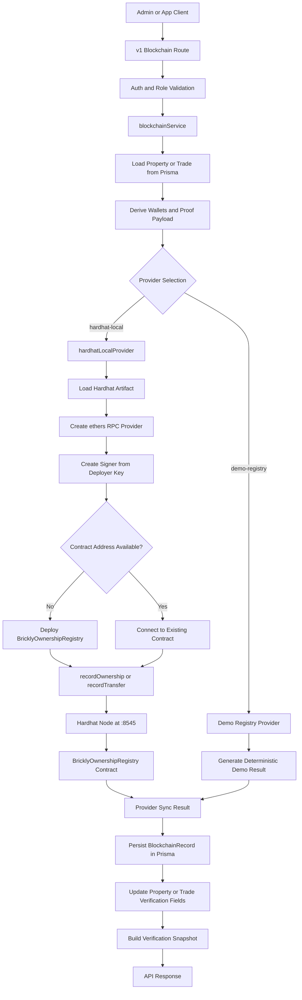

# Hardhat Implementation

## Purpose

Brickly uses Hardhat as a local smart contract development and verification layer for Phase 3 blockchain functionality. The current implementation is intentionally narrow:

- the application source of truth remains Postgres and Prisma
- the smart contract layer records ownership and transfer proofs
- the backend, not end-user wallets, writes to the contract
- the Hardhat integration is designed for local demo and test workflows

This is a hybrid architecture. The marketplace, holdings, and transaction workflows remain off-chain. Blockchain is used as an auditable proof layer on top of those operational records.

## High-Level Architecture

The implementation is split across four parts:

1. Hardhat project configuration
2. A single Solidity registry contract
3. Local deploy and demo scripts
4. Backend provider/service integration that calls the contract and persists verification records

Relevant files:

- [`hardhat.config.js`](/Users/prasadrane/Brickly/hardhat.config.js)
- [`contracts/BricklyOwnershipRegistry.sol`](/Users/prasadrane/Brickly/contracts/BricklyOwnershipRegistry.sol)
- [`scripts/deploy.js`](/Users/prasadrane/Brickly/scripts/deploy.js)
- [`scripts/demo-ownership-flow.js`](/Users/prasadrane/Brickly/scripts/demo-ownership-flow.js)
- [`apps/api/src/services/blockchain/providers/hardhat-local.provider.ts`](/Users/prasadrane/Brickly/apps/api/src/services/blockchain/providers/hardhat-local.provider.ts)
- [`apps/api/src/services/blockchain/index.ts`](/Users/prasadrane/Brickly/apps/api/src/services/blockchain/index.ts)

## System Flow Diagram

The diagram shows the current control flow for blockchain write operations. The key architectural point is that Prisma remains the operational source of truth, while Hardhat-backed contract writes are recorded as verification artifacts and linked back to application entities.

## Hardhat Configuration

The Hardhat config in [`hardhat.config.js`](/Users/prasadrane/Brickly/hardhat.config.js#L4) is minimal by design:

- Solidity version `0.8.24`
- optimizer enabled with `runs: 200`
- `hardhat` in-memory simulated network with chain ID `31337`
- `localhost` HTTP network targeting `http://127.0.0.1:8545` by default

The repo-level scripts in [`package.json`](/Users/prasadrane/Brickly/package.json#L8) provide the workflow:

- `npm run chain:node`
- `npm run chain:compile`
- `npm run chain:deploy`
- `npm run chain:demo`

This keeps the blockchain toolchain isolated from the main application runtime while still making it easy to run locally.

## Smart Contract Design

The only contract currently implemented is [`BricklyOwnershipRegistry.sol`](/Users/prasadrane/Brickly/contracts/BricklyOwnershipRegistry.sol#L8).

Its responsibilities are deliberately small:

- store ownership positions per `propertyId + holder`
- record ownership issuance events
- record transfer events
- expose a read method for the latest recorded position

Core functions:

- `recordOwnership(...)` writes an ownership position and emits `OwnershipRecorded`
- `recordTransfer(...)` debits one holder, credits another, and emits `TransferRecorded`
- `getPosition(...)` returns the latest stored position for a property-holder pair

Important design constraint:

- all state-changing methods are restricted by `onlyOwner`

That means this is not a decentralized exchange contract where individual investors execute trades from their wallets. Instead, the application backend acts as the authorized operator that writes verified proofs to chain.

## Data Representation

The contract expects a `bytes32 propertyId`, not a UUID or a long text key. In the backend and demo scripts, Brickly converts a string property identifier into a deterministic `bytes32` value using `ethers.id(...)`.

The contract also stores a `metadataHash` instead of full metadata. The richer payload stays off-chain in the application database, while the contract stores a compact hash reference.

This gives the current implementation three properties:

- stable on-chain identifiers
- low on-chain storage complexity
- application metadata remains queryable off-chain

## Deploy Script

The deploy script in [`scripts/deploy.js`](/Users/prasadrane/Brickly/scripts/deploy.js#L5):

1. connects through Hardhat
2. deploys `BricklyOwnershipRegistry`
3. waits for deployment finalization
4. writes deployment metadata to `.hardhat/deployments.json`
5. prints the deployment result as JSON

The saved output includes:

- network name
- chain ID
- contract name
- contract address
- deployer address
- deployment timestamp

This file is used as a simple local deployment record for development workflows.

## Demo Script

The demo flow in [`scripts/demo-ownership-flow.js`](/Users/prasadrane/Brickly/scripts/demo-ownership-flow.js#L27) is a thin end-to-end proof that the contract behaves as expected.

It does the following:

1. connects to the configured Hardhat network
2. loads three local signers
3. deploys the contract unless `BLOCKCHAIN_CONTRACT_ADDRESS` is already supplied
4. hashes a human-readable property label into a `bytes32` property ID
5. records initial ownership for investor A
6. records a transfer from investor A to investor B
7. reads both resulting positions back from the contract
8. prints transaction hashes, balances, and actor addresses

This script verifies the two primary contract operations Brickly currently needs:

- issue ownership
- transfer ownership

## Backend Provider Integration

The backend selects a blockchain provider in [`provider-factory.ts`](/Users/prasadrane/Brickly/apps/api/src/services/blockchain/providers/provider-factory.ts#L5).

- if `BLOCKCHAIN_PROVIDER=hardhat-local`, it uses the Hardhat-backed provider
- otherwise it falls back to the demo registry provider

The Hardhat provider implementation lives in [`hardhat-local.provider.ts`](/Users/prasadrane/Brickly/apps/api/src/services/blockchain/providers/hardhat-local.provider.ts#L118).

It is responsible for:

- locating the compiled Hardhat artifact
- loading the ABI and bytecode
- creating an `ethers` JSON-RPC provider for the configured Hardhat node
- building a signer from `BLOCKCHAIN_DEPLOYER_PRIVATE_KEY`
- auto-deploying the contract if no contract address is configured
- calling `recordOwnership(...)` and `recordTransfer(...)`

Provider methods:

- `issueShares(...)`
- `transferShares(...)`
- `syncRecord(...)`

`syncRecord(...)` is a convenience entry point that maps a persisted blockchain record back into the correct provider action.

## Backend Service Behavior

The orchestration layer is [`apps/api/src/services/blockchain/index.ts`](/Users/prasadrane/Brickly/apps/api/src/services/blockchain/index.ts#L24).

This service is the bridge between:

- Prisma entities such as properties and trades
- blockchain provider execution
- persisted blockchain verification history

Key responsibilities:

- fetch the appropriate property or trade
- derive proof payloads and wallet addresses
- call the selected blockchain provider
- persist each blockchain result in `BlockchainRecord`
- update `Property` or `Trade` verification state when confirmed
- return normalized verification snapshots to the API layer

### Ownership Proof Flow

When the app records ownership proof for a property:

1. it loads the property and its share class
2. it derives the holder wallet address if one is not supplied
3. it chooses the share count from the holder’s current holding or total share supply
4. it calls the provider’s `issueShares(...)`
5. it stores the result in `BlockchainRecord`
6. if confirmed, it updates the property verification status and blockchain tx hash

### End-to-End Ownership Proof Walkthrough

The concrete HTTP entry point is:

- `POST /v1/blockchain/properties/:propertyId/ownership-proof`

That route is defined in [`apps/api/src/modules/v1/router.ts`](/Users/prasadrane/Brickly/apps/api/src/modules/v1/router.ts#L244). The route:

1. requires authentication
2. restricts access to admins
3. validates request input with `blockchainOwnershipProofSchema`
4. calls `blockchainService.recordOwnershipProof(...)`
5. returns a normalized property verification snapshot

#### Step 1: Route Input

The route accepts:

- `propertyId` from the URL
- optional `ownerUserId`
- optional `txHash`
- optional `walletAddress`
- optional `contractAddress`
- optional `blockNumber`
- optional `proofPayload`

For the current Hardhat-local implementation, `propertyId` is the main required business identifier. The rest of the blockchain payload can be derived or enriched by the service.

#### Step 2: Property Lookup and Validation

Inside [`recordOwnershipProof(...)`](/Users/prasadrane/Brickly/apps/api/src/services/blockchain/index.ts#L317), the service:

1. loads the property by ID
2. verifies that the property exists
3. verifies that the property has a share class configured

If the property is missing, it throws `404 NOT_FOUND`. If the property has no share class, it throws `400 INVALID_STATE`.

This ensures the on-chain proof is always anchored to a valid off-chain asset record.

#### Step 3: Determine the Owner Context

The service then resolves the owner context.

If `ownerUserId` is provided:

- it attempts to load that user’s holding for the property share class

If `ownerUserId` is not provided:

- the ownership proof is treated more like a property-level proof for the asset rather than a specific investor holding

This is why the service supports both:

- investor-linked ownership proof
- property-level ownership proof

#### Step 4: Wallet Derivation

Next, the service derives the holder wallet address.

The selection logic is:

- use `walletAddress` from the request if provided
- otherwise, if `ownerUserId` exists, derive a deterministic address from `owner:<ownerUserId>`
- otherwise derive a deterministic address from `property:<propertyId>`

This logic is implemented in [`recordOwnershipProof(...)`](/Users/prasadrane/Brickly/apps/api/src/services/blockchain/index.ts#L339).

This makes local proofs deterministic even when no real wallet has been assigned.

#### Step 5: Share Count Selection

The service then decides how many shares should be written into the proof.

The current logic is:

- if a user holding was found, use `holding.sharesOwned`
- otherwise, use `property.shareClass.totalShares`

This means a user-scoped proof records the known owned position, while a property-scoped proof records the total share supply as the initial ownership figure.

#### Step 6: Provider Payload Assembly

The service calls `persistRecord(...)` with:

- `entityType: PROPERTY`
- `entityId: property.id`
- `recordType: OWNERSHIP_PROOF`
- `ownerUserId`
- `propertyId: property.id`
- holder wallet as the wallet reference
- a proof payload containing:
  - `holderAddress`
  - `sharesOwned`
  - `ownerUserId`
  - `propertyAddress`

At this point the application property data has been translated into the normalized proof shape used by the blockchain subsystem.

#### Step 7: Contract Call

Inside `persistRecord(...)`, ownership proofs are routed to `provider.issueShares(...)`.

For the Hardhat provider, that lands in [`hardhat-local.provider.ts`](/Users/prasadrane/Brickly/apps/api/src/services/blockchain/providers/hardhat-local.provider.ts#L132), which:

1. loads or deploys the contract
2. hashes the property ID with `ethers.id(...)`
3. hashes the metadata payload with `ethers.id(JSON.stringify(metadata))`
4. calls `recordOwnership(propertyId, holderAddress, sharesOwned, metadataHash)`
5. waits for the configured confirmation count

The contract then overwrites the holder’s position for that property and emits `OwnershipRecorded`.

That contract behavior is implemented in [`BricklyOwnershipRegistry.sol`](/Users/prasadrane/Brickly/contracts/BricklyOwnershipRegistry.sol#L45).

#### Step 8: Persist Blockchain Result

After the provider returns, `persistRecord(...)` creates a `BlockchainRecord` row containing:

- entity metadata
- sync status
- tx hash
- block number
- wallet address
- contract address
- chain ID
- proof payload
- sync and verification timestamps
- last error when applicable

This creates a durable application-side history for every blockchain write attempt.

#### Step 9: Update Property Verification State

Back in [`recordOwnershipProof(...)`](/Users/prasadrane/Brickly/apps/api/src/services/blockchain/index.ts#L365), the service updates the property row:

- if the blockchain call was confirmed, `verificationStatus` becomes `VERIFIED`
- `blockchainTxHash` is updated if a transaction hash is available

This is how the operational property record becomes linked to the ownership proof.

#### Step 10: Return a Verification Snapshot

Finally, the service returns `getPropertyVerification(property.id)`.

That snapshot includes:

- blockchain enabled flag
- provider and provider status
- network and chain ID
- contract address
- latest preferred blockchain record
- full blockchain record history for the property
- effective verification status
- effective blockchain reference

So the ownership-proof endpoint returns an application-facing verification view rather than only a raw transaction result.

### Transfer Proof Flow

When the app records transfer proof for a trade:

1. it loads the trade
2. it ensures the seller has a recorded on-chain ownership position when Hardhat local is active
3. it derives deterministic demo wallet addresses for buyer and seller if needed
4. it calls the provider’s `transferShares(...)`
5. it stores the result in `BlockchainRecord`
6. if confirmed, it updates the trade verification status and blockchain tx hash

### End-to-End Transfer Proof Walkthrough

The concrete HTTP entry point is:

- `POST /v1/blockchain/transactions/:transactionId/transfer-proof`

That route is defined in [`apps/api/src/modules/v1/router.ts`](/Users/prasadrane/Brickly/apps/api/src/modules/v1/router.ts#L325). The route:

1. requires authentication
2. restricts access to admins
3. validates request input with `blockchainProofSchema`
4. calls `blockchainService.recordTransferProof(...)`
5. returns a normalized verification snapshot

#### Step 1: Route Input

The route accepts:

- `transactionId` from the URL
- optional `txHash`
- optional `walletAddress`
- optional `contractAddress`
- optional `blockNumber`
- optional `proofPayload`

In practice, for the Hardhat-local implementation, the most important input is the `transactionId`. The service derives most of the actual transfer proof payload from the existing trade record rather than trusting the caller to provide all business-critical values.

#### Step 2: Trade Lookup

Inside [`recordTransferProof(...)`](/Users/prasadrane/Brickly/apps/api/src/services/blockchain/index.ts#L379), the service first loads the trade by ID.

If the trade does not exist, it throws `404 NOT_FOUND`.

This is important because the blockchain operation is tied to an already-existing off-chain trade. The contract is not asked to discover trade data on its own.

#### Step 3: Ensure Seller Ownership Exists On-Chain

Before a transfer is submitted, the service calls [`ensureTransferSourceOwnership(...)`](/Users/prasadrane/Brickly/apps/api/src/services/blockchain/index.ts#L189).

This helper is only meaningful when the selected provider is `hardhat-local`.

Its job is to prevent a local-chain transfer from failing simply because the seller’s position has not yet been mirrored on-chain. It does this by:

1. loading the property share class
2. loading the seller’s current holding from Prisma
3. deriving a deterministic seller wallet address
4. checking the latest confirmed ownership proof for that property
5. auto-issuing an ownership proof if the seller does not already have enough shares recorded on-chain

This means the app can bridge from database-first holdings into the local-chain registry without requiring a separate manual seeding step before every transfer.

#### Step 4: Wallet Derivation

After the seller-source check, the service derives the transfer participants:

- buyer wallet: provided `walletAddress` or a deterministic derived address based on `buyerUserId`
- seller wallet: deterministic derived address based on `sellerUserId`

This logic lives in [`recordTransferProof(...)`](/Users/prasadrane/Brickly/apps/api/src/services/blockchain/index.ts#L387).

The current implementation therefore uses stable pseudo-wallet addresses for local/demo flows. That keeps the blockchain side deterministic without requiring real wallet onboarding.

#### Step 5: Provider Payload Assembly

The service then calls `persistRecord(...)` with:

- `entityType: TRADE`
- `entityId: trade.id`
- `recordType: TRANSFER_PROOF`
- `propertyId: trade.propertyId`
- `tradeId: trade.id`
- `sellOrderId: trade.sellOrderId`
- buyer wallet as the main wallet reference
- a proof payload containing:
  - `propertyId`
  - `sharesTransferred`
  - `fromAddress`
  - `toAddress`
  - `buyerUserId`
  - `sellerUserId`

This is the point where the service converts application trade data into a blockchain-proof shape.

#### Step 6: Contract Call

Inside `persistRecord(...)`, transfer proofs are routed to `provider.transferShares(...)`.

For the Hardhat provider, that ends up in [`hardhat-local.provider.ts`](/Users/prasadrane/Brickly/apps/api/src/services/blockchain/providers/hardhat-local.provider.ts#L193), which:

1. loads or deploys the contract
2. hashes the property ID with `ethers.id(...)`
3. hashes the metadata payload with `ethers.id(JSON.stringify(metadata))`
4. calls `recordTransfer(propertyId, fromAddress, toAddress, sharesTransferred, metadataHash)`
5. waits for the configured confirmation count

The contract itself then:

- checks that the sender has enough shares
- decrements the sender balance
- increments the receiver balance
- emits `TransferRecorded`

That behavior is implemented in [`BricklyOwnershipRegistry.sol`](/Users/prasadrane/Brickly/contracts/BricklyOwnershipRegistry.sol#L62).

#### Step 7: Persist Blockchain Result

After the provider call returns, `persistRecord(...)` creates a `BlockchainRecord` row containing:

- sync status
- tx hash
- block number
- contract address
- chain ID
- wallet address
- proof payload
- timestamps
- error information if applicable

This persistence step is what gives the application a durable verification history even though the actual proof lives on-chain.

#### Step 8: Update Trade Verification State

Back in [`recordTransferProof(...)`](/Users/prasadrane/Brickly/apps/api/src/services/blockchain/index.ts#L414), the service updates the trade row:

- if the blockchain call was confirmed, `verificationStatus` becomes `VERIFIED`
- `blockchainTxHash` is updated if a transaction hash is available

This is how the operational transaction record becomes linked to the blockchain proof.

#### Step 9: Return a Verification Snapshot

The last step is a call to `getTransactionVerification(...)`, which loads all blockchain records for that trade and builds a normalized snapshot.

That response includes:

- blockchain enabled flag
- provider name
- network and chain ID
- contract address
- latest preferred blockchain record
- full record history for the entity
- effective verification status
- effective blockchain reference

So the API does not just return raw transaction execution data. It returns an application-facing verification view built from both the trade record and persisted blockchain sync history.

## Why This Flow Looks This Way

The transfer-proof flow is designed to preserve the current platform architecture:

- trade matching and settlement logic remain off-chain
- blockchain records attest to ownership and transfer events after the fact
- the backend remains the trusted orchestrator
- the system can tolerate blockchain being disabled without breaking core marketplace flows

This lets Brickly demonstrate blockchain integration without moving core marketplace state management out of Prisma and into smart contracts.

## Deterministic Demo Wallets

The service derives demo wallet-like addresses from user IDs using a SHA-256 hash in [`apps/api/src/services/blockchain/index.ts`](/Users/prasadrane/Brickly/apps/api/src/services/blockchain/index.ts#L26).

This is a development convenience:

- it gives stable pseudo-wallet addresses without requiring every user to manage a real wallet
- it allows repeatable local demos
- it keeps the current implementation aligned with the app’s off-chain identity model

This is suitable for demo/testing only. A production blockchain design would need a real wallet and signing strategy.

## Persistence Model

Blockchain activity is persisted in the application database through [`blockchain.repository.ts`](/Users/prasadrane/Brickly/apps/api/src/repositories/blockchain.repository.ts#L8).

Each blockchain attempt can produce a `BlockchainRecord` that stores:

- entity type and entity ID
- record type such as ownership proof or transfer proof
- sync status
- tx hash
- block number
- contract address
- chain ID
- wallet address
- proof payload
- sync and verification timestamps
- last error

This matters because the app does not treat blockchain as a fire-and-forget side effect. It keeps a durable verification history that can be surfaced back to the UI and admin tools.

## API Surface

The current blockchain routes are defined in [`apps/api/src/modules/v1/router.ts`](/Users/prasadrane/Brickly/apps/api/src/modules/v1/router.ts#L235):

- `GET /v1/blockchain/properties/:propertyId/verification`
- `POST /v1/blockchain/properties/:propertyId/ownership-proof`
- `GET /v1/blockchain/transactions/:transactionId/verification`
- `POST /v1/blockchain/transactions/:transactionId/transfer-proof`
- `POST /v1/blockchain/sync`

The write endpoints are admin-protected. Read endpoints expose normalized verification snapshots that merge database state and blockchain record state.

## Operational Model

The current implementation should be understood as:

- local Hardhat chain for development
- one owner-operated registry contract
- backend-driven on-chain writes
- database-first business logic
- blockchain as verification and audit enrichment

It is not currently:

- an on-chain order book
- a wallet-to-wallet settlement system
- a self-custody investor trading system
- a production network deployment strategy

## Current Limitations

Known constraints of the current design:

- only one contract is implemented
- the backend owns all mutation authority
- local demo addresses are derived, not user-controlled
- property and metadata references are hashed before being written on-chain
- the main marketplace logic still executes off-chain
- the setup is aimed at local demo/testing, not production deployment

These constraints are consistent with the current Phase 3 goal: prove the integration pattern before expanding the blockchain surface area.
