# Brickly System Flows Architecture

This document captures the implemented service topology and the main sequence
of events across the Brickly platform. The diagrams are based on the current
code paths in the repo, not a future-state proposal.

## Service Topology

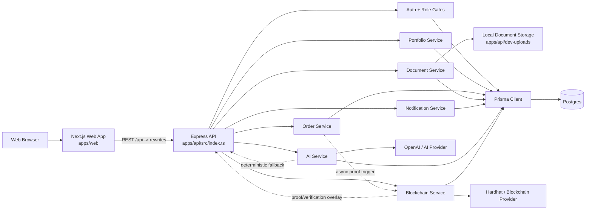

## Backend Service Boundaries

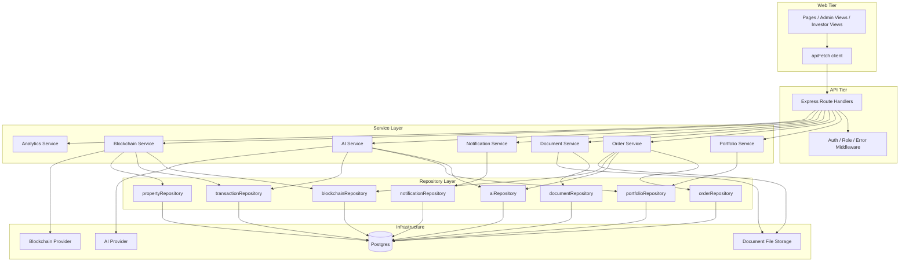

## Request Domains

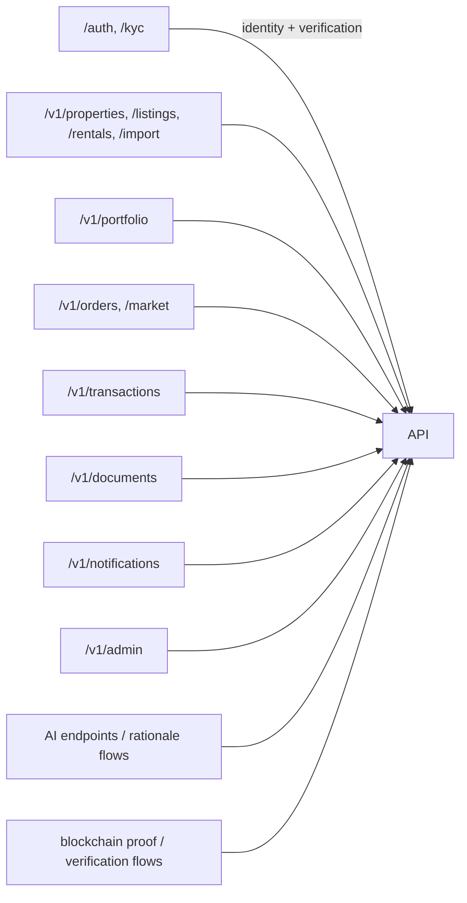

## Sequence Flows

### 1. Authentication And Session Bootstrap

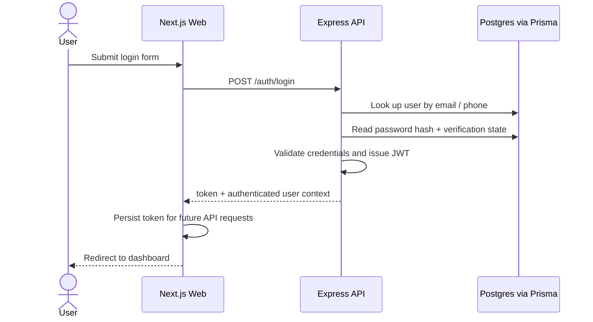

### 2. Portfolio Summary Read Flow

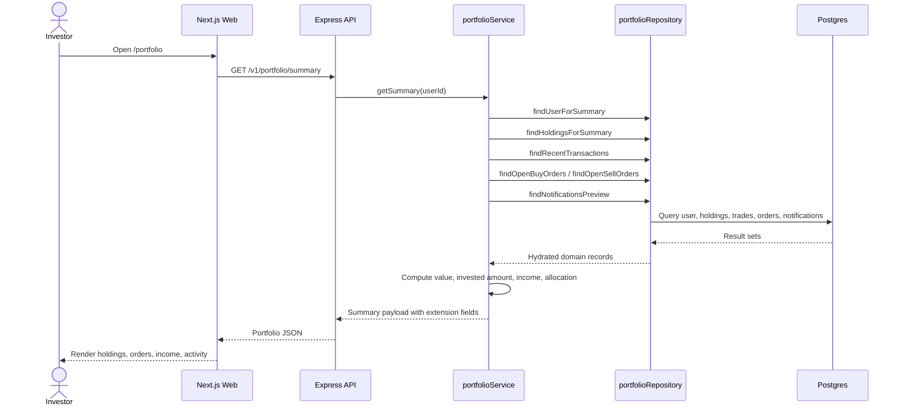

### 3. Buy Order Execution Flow

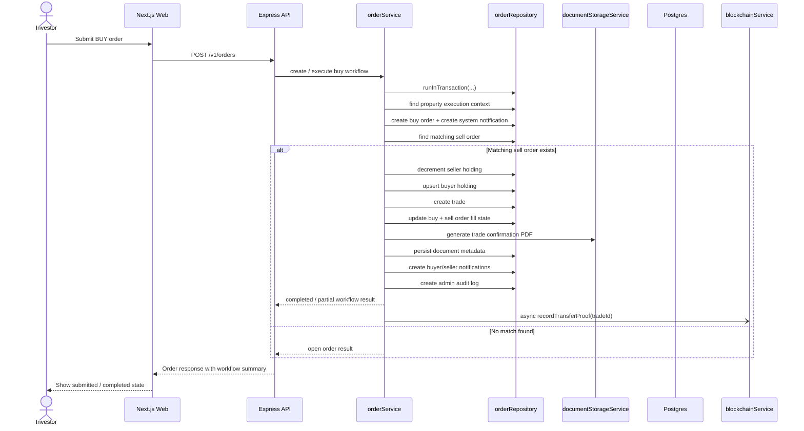

### 4. Document Upload Stub Flow

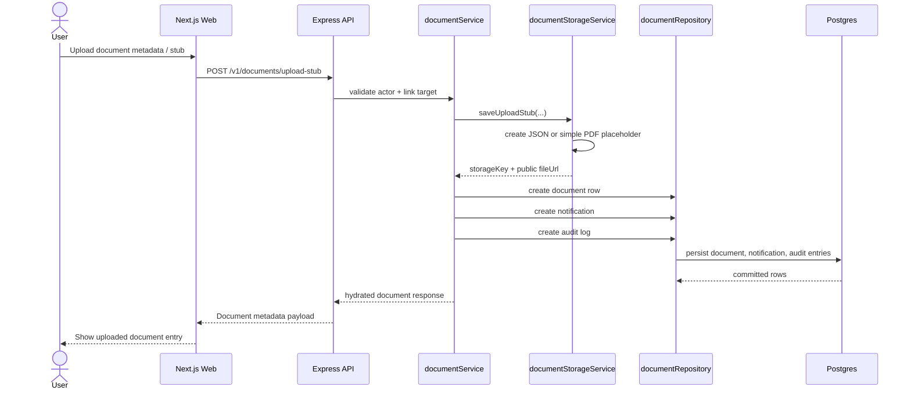

### 5. AI Summary / Fallback Flow

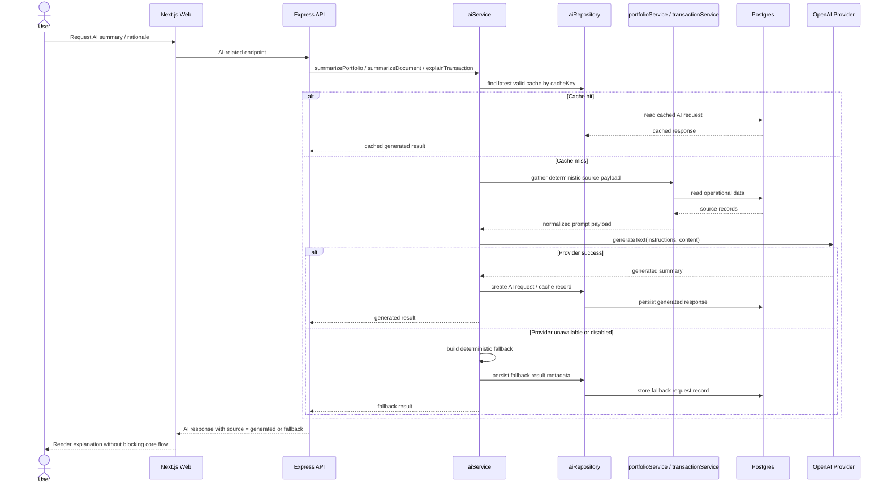

### 6. Blockchain Transfer Proof Flow

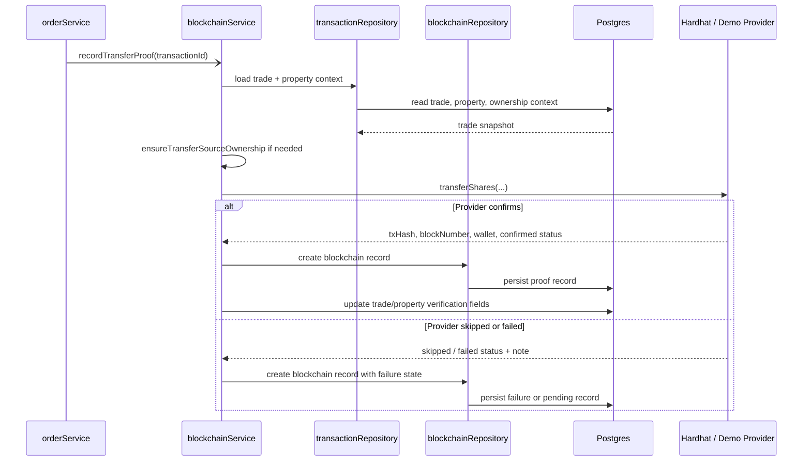

### 7. Blockchain Verification Read Flow

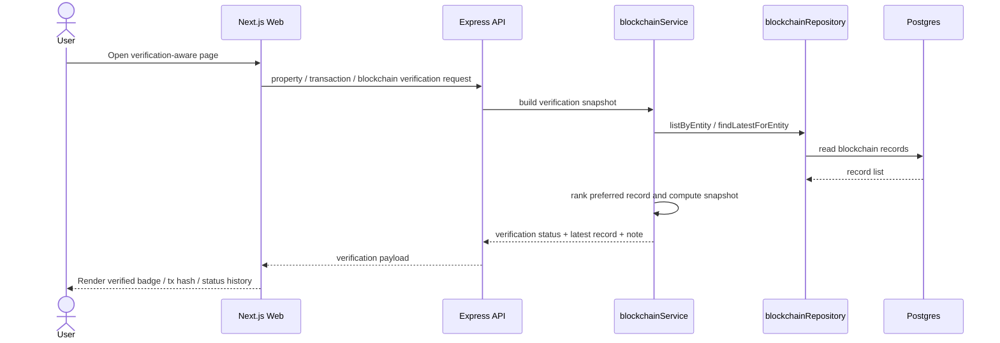

### 8. Notification Read And Acknowledge Flow

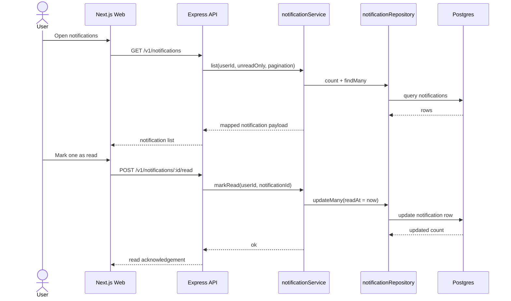

## Operating Principles Reflected In The Code

- Postgres remains the operational source of truth for users, holdings, orders,
  trades, documents, and notifications.
- AI is additive. It explains portfolio, transaction, document, and sell-price
  context, but it degrades to deterministic fallback when the provider is
  unavailable.
- Blockchain is also additive. Verification and proof records are stored and
  surfaced, but operational trading can still complete even when blockchain
  proof execution fails.
- File storage is local-development oriented today. Document binaries and stubs
  are written under `apps/api/dev-uploads`.
- Most route composition still lives in `apps/api/src/index.ts`, while service
  and repository layers already provide the main domain seams.

## Primary Source Files

- `apps/api/src/index.ts`
- `apps/api/src/services/operational/portfolio.service.ts`
- `apps/api/src/services/operational/order.service.ts`
- `apps/api/src/services/operational/document.service.ts`
- `apps/api/src/services/operational/notification.service.ts`
- `apps/api/src/services/ai/index.ts`
- `apps/api/src/services/blockchain/index.ts`
- `apps/api/src/services/storage/document-storage.ts`
- `apps/api/src/repositories/*.ts`
- `apps/web/pages/*`
- `apps/web/lib/api.ts`
